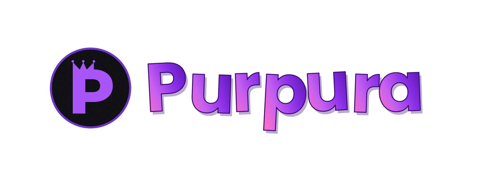

  

  <strong>Purpura</strong> is a modern browser extension that enhances the Roblox experience with quality-of-life features and powerful customization, completely free.

  <a href="https://chromewebstore.google.com/detail/purpura-roblox-enhanced/lpneoiebggmkhlldeongbcipekohjepc"><strong>Chrome Web Store</strong></a> •
  <a href="https://github.com/TeutonicTerrror/Purpura-Project/releases">GitHub Releases</a> •
  <a href="https://discord.gg/TT4sgtEkNV">Discord</a> •
  <a href="https://ko-fi.com/teutonicterror">Ko-fi</a>

  
  
  
  

---

## Official Links

- **Chrome Web Store:** https://chromewebstore.google.com/detail/purpura-roblox-enhanced/lpneoiebggmkhlldeongbcipekohjepc
- **Public Repository / Releases:** https://github.com/TeutonicTerrror/Purpura-Project
- **Discord:** https://discord.gg/TT4sgtEkNV
- **Roblox Group:** https://www.roblox.com/communities/35582394/Purpura-Extension#!/about

> [!WARNING]
> Purpura is only distributed through the official [Chrome Web Store](https://chromewebstore.google.com/detail/purpura-roblox-enhanced/lpneoiebggmkhlldeongbcipekohjepc) and the public [GitHub repository](https://github.com/TeutonicTerrror/Purpura-Project). Verify what you are downloading before installing.

---

## Support the Project

If you find Purpura useful, please consider leaving a review on the [Chrome Web Store](https://chromewebstore.google.com/detail/purpura-roblox-enhanced/lpneoiebggmkhlldeongbcipekohjepc). You can also give the repository a star on GitHub or [support on Ko-fi](https://ko-fi.com/teutonicterror). It helps a lot and supports continued development.

---

## Installation

### Option 1: Chrome Web Store (Recommended)

Install directly from the [Chrome Web Store](https://chromewebstore.google.com/detail/purpura-roblox-enhanced/lpneoiebggmkhlldeongbcipekohjepc).

### Option 2: Manual Installation (Developer Mode)

<strong>Expand instructions</strong>

1. Download the latest `purpura_chromium.zip` from [Releases](https://github.com/TeutonicTerrror/Purpura-Project/releases) and unzip it.
2. Open `chrome://extensions` and enable **Developer Mode** (top-right).
3. Click **Load unpacked** and select the unzipped folder (the one containing `manifest.json`).

---

## License

Purpura source code is licensed under the **GNU General Public License v3.0** unless otherwise stated. See [`License.md`](License.md) for the full license text.

The following assets are **not** covered by GPL-3.0:

- `images/` contains Purpura branding and other visual assets. Purpura branding remains under the copyrights of TeutonicTerror and is not covered by GPL-3.0 unless explicitly stated. Other assets in this directory remain subject to their respective copyrights and licenses.
- `content/feat/cust/aeditor/three/` -- Three.js r128, licensed separately under the **MIT License** (Copyright 2010-2021 Three.js Authors). You are free to reuse Three.js under its own MIT terms.

---

## Credits

- **Contributors:** https://github.com/TeutonicTerrror/Purpura-Project/graphs/contributors
- **Testers:** CJiggy, Deluxis
- **Inspiration and region help:** Valra
- **Development:** TeutonicTerror and [contributors](https://github.com/TeutonicTerrror/Purpura-Project/graphs/contributors)

---

*Purpura is not affiliated with Roblox Corporation.*
